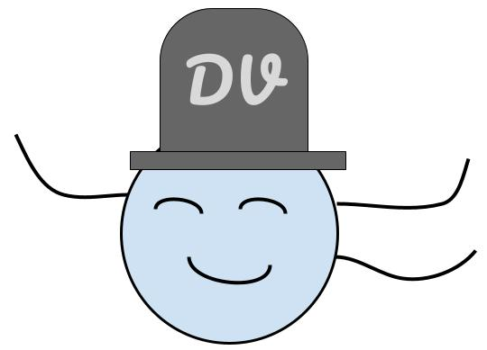
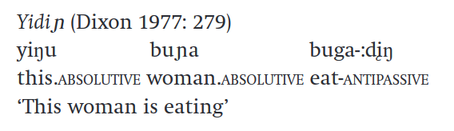
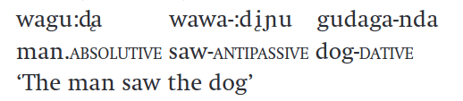
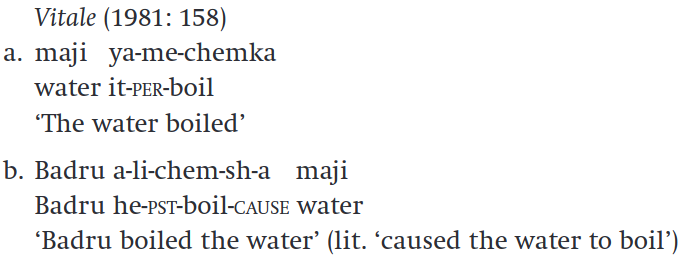
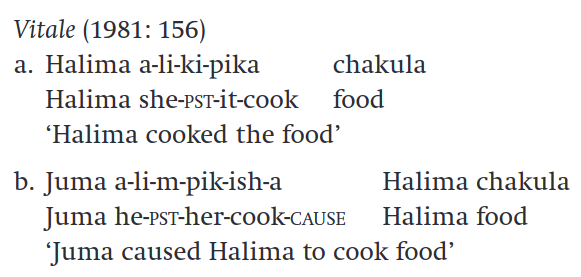
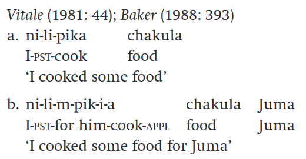
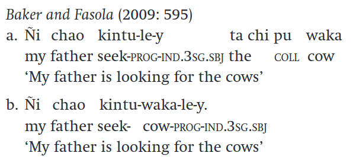
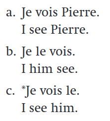

# Valency and arguments
  
::: {.callout-tip}
## Valency
Number of arguments that a verb takes.
:::

- Note that **argument** is a **semantic** concept, whereas **subject, object** and **adjunct** are **syntactic** concepts.
- Arguments are **phrases that are semantically necessary for a verb**, or are implied by the meaning of the verb.

# Verbs according to transitivity

:::: {.columns}

::: {.column width="33%"}

- Verbs that have only one argument are intransitive. 
Ex: snore

::: {.fragment}

:::

:::

::: {.column width="34%"}
- Transitive verbs require two arguments: a subject and an object. 
- Ex: discuss

::: {.fragment}

:::

:::

::: {.column width="33%"}
- Sometimes, a verb will require three arguments. They are called ditransitive verbs.
- Ex: give

::: {.fragment}

:::

:::

::::

# Are arguments obligatory?

- Some arguments are not mandatory (though they often are). 
- Example: eat
  - _I'm eating._ :heavy_check_mark:
  - _I'm eating a pizza._ :heavy_check_mark:

- Note that prepositional phrases are not necessary to the meaning of the verb, therefore they are not arguments. Syntactically speaking, these are **adjuncts**.

- However, languages have -to different extents- morphological mechanisms to change the valency of the verb

- This way, we can e.g. **turn a transitive verb into an intransitive one**, or vice versa.

# Passivization { .nostretch}

- In active sentences, the subject of the sentence is the agent: 

::: {.fragment}

{width="60%"}

:::

- ...whereas in the passive sentence we don't need the agent.

::: {.fragment}

{width="60%"}

:::

# Anti-passive

- The anti-passive also reduces the number of arguments of the verb. However, instead of eliminating the agent, what disappears is **the patient**.
- The argument made optional can also be expressed explicitly, but in different case
  - In anti-passive sentences, the subject is absolutive and the object, when expressed, goes in dative or locative case

::: {.fragment}

  

:::

# Causatives

- Causatives add a new argument: the subject, which is the causer of the action

:::: {.columns}

::: {.column width="50%"}

- Note that 'boil' has only one (patient) argument, to which the causer is added

::: {.fragment}

:::

:::

::: {.column width="50%"}

- In the second example, the verb has two arguments, to which a third one is added.

::: {.fragment}

:::

:::

::::
# Applicative {.nostretch}

- Applicative morphology adds an object to the valency of the verb.

::: {.fragment}

{width="50%"}

:::

# Noun Incorporation {.nostretch}

- Some languages (usually polysynthetic ones) may allow for the Incorporation of a noun as part of the verb

::: {.fragment}

{width="60%"}

:::

# Clitics

- Clitics are neither affixes nor free morphemes:
  - They don't bear stress
- They form one single phonological word with an adjacent word (host)

- _'ll_ is the contracted form of _will_, and _'d_ the contraction of _would_.
- Note that these may also attach to other word categories:

- Clitics may appear before or after the host
  - Proclitics come **before** the host
  - Enclitics come **after** the host
 
# Simple and special clitics {.nostretch}

- In English, forms such as _'ll_ or _'d_ are examples of simple clitics, which are unaccented variants of free morphem es and appear in the same position as the free word would

- **Special clitics** also depend on a host, but they are not reduced forms of independent words. Though it may appear written apart from the host, they cannot form a phonological word.

::: {.fragment}

{width="20%"}

:::

# Phrasal verbs

- In English, phrasal verbs consist of a verb and a preposition:
  - call up
  - put down
  - chew out 
- They tend to have idiomatic meanings 
- However, they are not compounds, since verb and prepositions may not appear together (one after another)
  - I called my friend up.

# Phrasal compounds

- Compound consisting of phrase + noun:

  - stuff-blowing-up effects!
  - take-it-or-leave-it stance

# Morphological vs. syntactic expression

- Some languages may express things morphologically, which means they deploy inflection or derivation mechanisms to convey meaning

- Ganar-e-mos
- win-FUT-1.PL

- Other languages, while still being able to convey the same meaning, might have to do so periphrastically: English _We will win_ is the equivalent of _Ganaremos_

# Summary

- Morphology and syntax are not fully independent from each other
- Morphology may affect the syntax of a sentence by changing the valency of the verb

- Some phenomena may blur the line between morphology and syntax, such as clitics, phrasal verbs, and phrasal compounds

- Some languages may have several mechanisms that allow for morphological expression of meaning, while others do so periphrastically

# Next week

- Finish exercises
- Attend your tutorial
